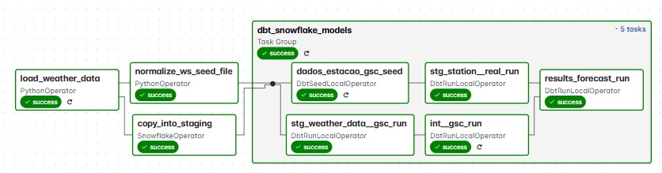

___
# Weather Forecast Data Pipeline (Snowflake, dbt, Airflow)
This project demonstrates a solution for automating the ingestion, transformation, and analysis of weather forecast data. Using advanced tools such as dbt with Apache Airflow, I orchestrate data transformations within Snowflake. Through Astronomer Cosmos, I run dbt models within Airflow DAGs, facilitating the automation of the entire process.
___
### Technologies:
- **Airflow (Astronomer Cosmos)**: Orchestrates the pipeline and schedules tasks.
- **dbt**: Transforms and tests data in Snowflake.
- **Snowflake**: Stores and processes weather forecast data.
- **AWS S3**: Stores raw weather data before ingestion.
- **Docker**: Runs Airflow and dbt in isolated, consistent environments.
- **Git**: Tracks and manages project code.
- **Visual Studio Code**: The development environment used for writing and managing project code.
___
**🌱 Motivation:**
- In agriculture, weather plays a crucial role in crop production. A good rainfall at the right time can significantly impact yields, while poor weather conditions can bring challenges. For instance, after planting soybeans, immediate rainfall can cause issues like seedling failure or seed rot. Excessive rainfall can lead to localized flooding and root rot. Additionally, more accurate weather forecasts can help optimize irrigation decisions, preventing unnecessary irrigation when rain is expected, or ensuring timely irrigation when rainfall does not materialize. This project automates the orchestration, transformation, and analysis of weather forecast data, with the goal of evaluating the accuracy of weather predictions by comparing them to actual data from a local weather station.
___
## 📁 Project Structure:

```
├── dags/
│   └── weather_dag.py
├── dbt_airflow_snowflake/
│   ├── dbt_project.yml
|   +---models
|   |   |   __sources.yml
|   |   |   
|   |   +---intermediate
|   |   |       int__gsc.sql
|   |   |       
|   |   +---marts
|   |   |       agg_precipitation_forecast.yml
|   |   |       results_forecast.sql
|   |   |       
|   |   \---staging
|   |       +---weather_forecast
|   |       |       stg_weather_data.yml
|   |       |       stg_weather_data__gsc.sql
|   |       |       
|   |       \---weather_station
|   |               stg_station__real.sql
|   |               _station__real.yml
|   |               
|   +---seeds
|   |       .gitkeep
|   |       dados_estacao_gsc.csv
+---include
|   |   constants.py
|   |   copy_into_stg_weather.sql
|   |   profiles.py
|   |   weather_utils.py
├── plugins/
├── tests/
├── Dockerfile
├── requirements.txt
└── README.md
```
___
### DAG Overview:



___
### Pipeline Workflow:
- **Extract**: New weather forecast data is fetched daily via API and saved to an AWS S3 bucket, orchestrated by Airflow.
- **Load** (Airflow with Astronomer Cosmos): Airflow automates the process of loading the raw data from S3 into Snowflake.
- **Transform (dbt)**: dbt cleans and transforms the raw data into structured tables in Snowflake.
  **Sources**
   - `stg_weather_data`: Weather forecast data loaded from S3 (`weather_forecast`)
   - `dados_estacao_gsc.csv`: Real precipitation data from a station (seed)
  **Staging Models**
   - `stg_weather_data__gsc.sql`: Filters forecast data to only **Granja Santa Catarina** and converts timezone.
   - `stg_station__real.sql`: Formats real station data.
  **Intermediate Model**
   - `int__gsc.sql`: 
     - Aggregates daily precipitation forecasts by forecast date.
     - Pivots the data to compare each forecast date with the day it was predicted (D0 to D9).
  **Mart Model**
   - `results_forecast.sql`: Joins forecasted precipitation with actual recorded data for comparison.
- **Test** (dbt): I applied Basic dbt tests to ensure data quality and identify issues early.
- **Analyze**: The processed data is analyzed by comparing forecasted precipitation with actual measurements to evaluate prediction accuracy.

___
### What I'm Working On:
The project is still evolving, and right now, I’m focusing on integrating real-world weather station data to compare actual weather conditions with forecasts.

#### Upcoming Work:
- Evaluating forecast accuracy based on actual weather measurements.
- Improving forecast models to increase prediction accuracy.